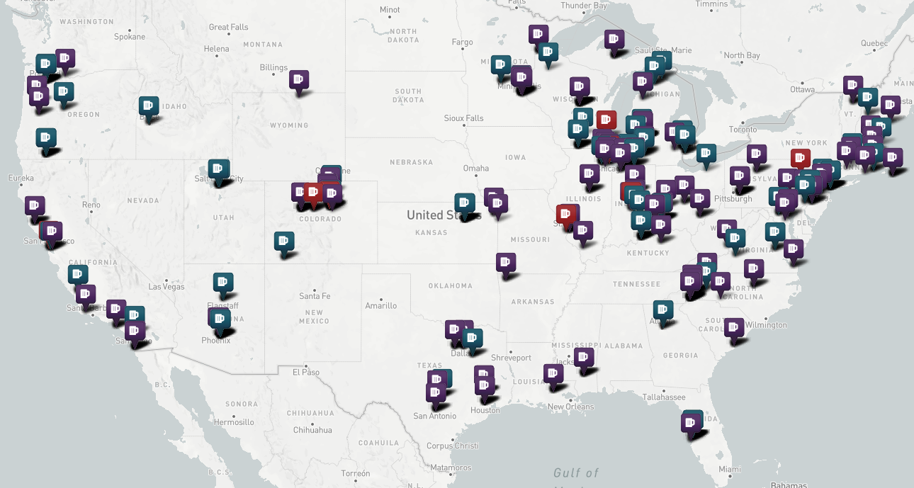

# Beertopia

For beer enthusiasts, the craft beer segment of the alcohol and beverages industry has a ton of options. Some of the questions that are relevant for beer enthusiasts are as follows:-
- How are craft beers differentiated?
- What are the most common beer styles consumed in the US?
- What are the states with the most craft beer consumption?

To answer these questions, we cleaned our dataset and later built a web application that shows various beer styles, a map showing the state with most beer consumption, a data table, and a map showing brewering ratings.

## Technologies used:
```
Pandas
Python
Javascript
Html
CSS
```

## Data Clean Up Process:

The dataset had ______ number of columns and ______  number of rows. Since our dataset was so large, we had to remove unnecessary data by using Pandas. Our final dataset which only consists of breweries located in US resulting in ______ data. 

## Data Visualization (JavaScript library used)
#### Sunburst chart:
#### Choropleth:
#### Word cloud:

## Data Table 

The data table section (data.html) shows the entire data set when loaded. The records are filterable by 4 fields:

 - Brewery Names
 - State
 - Beery Style
 - Brewery Ratings

Datatable is being displayed by calling a .js file with json entries for each record which was created by running a simple csv to json conversion.

```
import csv
import json

csvfile = open('final_beer.csv', 'r')
jsonfile = open('final_beer.json', 'w')

fieldnames = ("index","brewery_name","city","state","beer_name","style","latitude","longitude","rating","abv_percent")
reader = csv.DictReader( csvfile, fieldnames)
for row in reader:
    json.dump(row, jsonfile)
    jsonfile.write(',\n')
```
The purpose of showing a data table is to have users answer the following questions:
- Which breweries are located near me (or to a particular place)?
- Which beers are produced by these breweries (with ratings and abv info)?
- Which beers have the best rating?

## Map 
The map shows all the breweries in US from the data we have collected. Due to the large number of records which has resulted the page to load very slowly, we decided to only show the first 1500 records from our data. 

#### Getting Coordinates
The data file only had the list of brewery names, city and state. To map each breweries, we used Google Maps API to get the coordinates.

The map was possible with use of Leaflet Extra Markers and Font Awesome (https://github.com/coryasilva/Leaflet.ExtraMarkers). Clicking on the marker will show the name of the breweries and their respective ratings. The control buttons which are located on the top right corner lets you filter the breweries by their ratings. Breweries with a rating of less than 4 are marked red, between 4.1 to 4.5 are marked blue and greater than 4.5 are marked purple.



## Heroku Deployment
Heroku is a hosting platform where you can deploy dynamic applications using any of the following web applications: Rails, PHP, Node.js and Python.

#### Pre-requisites
- Have git installed
- Sign up for Heroku Account

#### Deploying Your Site
Navigate to your project in the git bash.
```
cd Final
```
Create an index.php file. The purpose of this file is to trick Heroku to deploy a static site by including 1 dynamic file which it recognizes. In simple terms, you are trying to masquerade the HTML app which you build build as a PHP application. Add the following code into the index.php.
```
<?php header( 'Location: /index.html' ) ;  ?>
```
Open git bash. Run the command one at a time:
```
git init
git add .
```
add . means it will add all the files to the git repository.
Then commit to repo
```
git commit -m "Ready for deployment."
```
Login into Heroku site before you run the next command
```
heroku apps:create my-website-name
```
Insert your desired name instead of my-website-name.
```
git push heroku master
```
You are done
You can now visit your site at https://my-website-name.herokuapp.com/.
If you need to make changes to your site after deployment, please follow below steps:
After adding the changes to your code. Run the following commands in git bash one at a time.
```
git add .
Save the changes…
git commit -am "updated files"
Then deploy…
git push heroku master
```

## Challenges/Limitations: 
- Some of the brewery location values(latitude, longitude) has been approximated.
- The rating for individual beer was not available, the indicated rating in data page is for brewery as a whole. 
- One of the data sources did not had beer style defined.


## Contributors 
 - Sai
 - Dan
 - Deepen
 - Pratikchhya
 - Pavana
